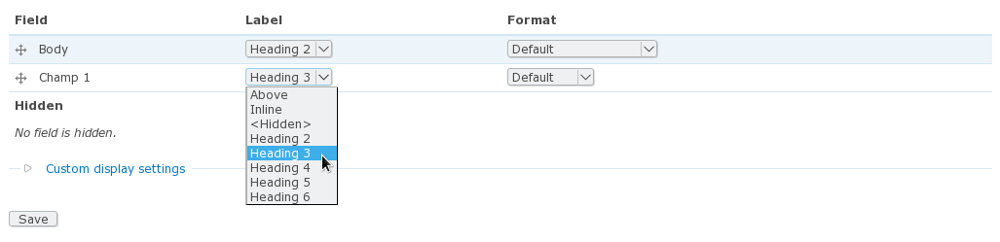

label_tag
=========

Drupal module which allows you tu use H2, H3… tags for field labels.

Installation
------------

Install it as any other Drupal module.

Requirements
------------

This is a Drupal 7 module requiring the field module in order to work
(shouldn’t be too hard to have it enabled :o) ).

How to use it
-------------

Go to `admin/structure/types/manage/<node-type>/display`

Select the label type you want to use and save. That’s it!

